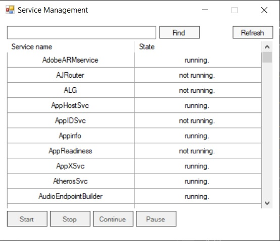

# Windows Service Management

## Description ##
Welcome to the Windows Service Management project, which aims to provide a convenient and efficient way to manage Windows services. This implementation features a custom COM object built using C++ ATL, allowing for basic service operations. For this project, I chose to build a C# GUI due to its simplicity and flexibility.

## Installation and Setup ##

To use this application, follow the steps below:

1) Set up the COM object by performing the following steps:
    1) Clone the repository to your local machine.
    2) Build the "COMWindowsServices" project for either x86 or x64 platform.
    3) Add the created object to the registry by following these steps:
        1) Open Command Prompt with administrative privileges.
        2) Type the following command in the Command Prompt window:
      `regsvr32.exe //path/to/your/dllfile`
      
2) To set up "WindowsServiceManagementCSharpGUI", follow these steps.
    1) Open "WindowsServiceManagementCSharpGUI" project
    2) Add a reference to the COM library you created earlier
    3) Build the "WindowsServiceManagementCSharpGUI" project using the same platform as the one you used for the COM setup.
    
3) Build the "WindowsServiceManagementCSharpGUI" project using the same platform or higher that you used for the COM setup

**Note:** For full functionality, it is recommended that you run the application with administrator privileges, as otherwise some features may be limited.
